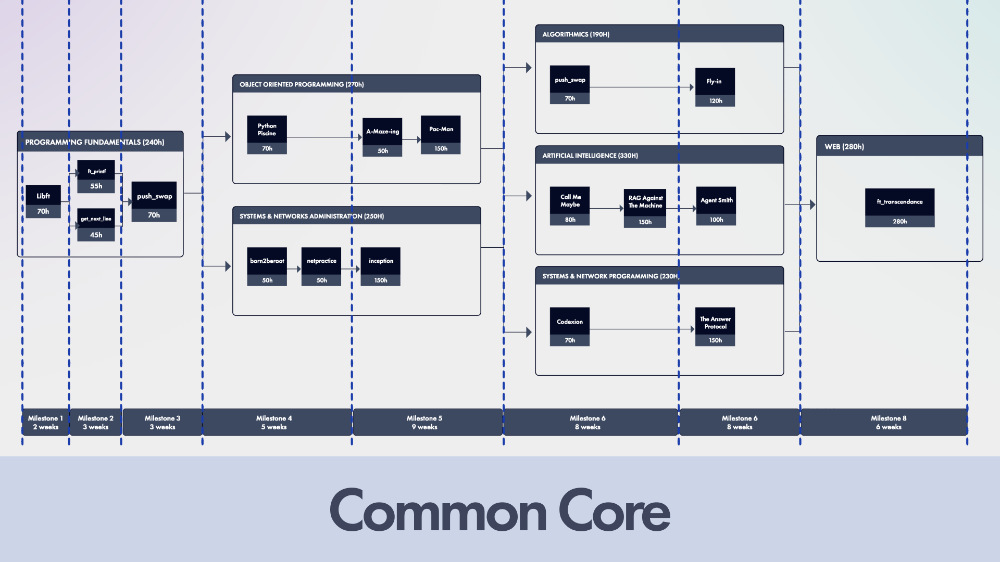

# Common Core

Le **Common Core** est la première partie du cursus 42. Il permet de couvrir toutes les bases indispensables avant d'arriver sur le marché du travail.
- **Structure :** Il se découpe en plusieurs **milestones**.
- **Contenu :** Il est composé de **projets** pratiques et d'**examens** réguliers.
- **Objectif :** Valider le socle technique commun à tous les étudiants de 42.

### Les projets du Common Core (42 Next)
Retrouve tous les projets du Common Core par milestone ici :

---

## Holygraph V2/V3
  
  ### Les Milestones
  ---
  Après avoir terminé la Piscine, les étudiants commencent leur cursus avec Libft. Une fois ce projet terminé, ils passent au milestone suivant, puis au suivant après avoir complété les  projets de chaque milestone. 
  ### Les Exams
  ---
  À partir du deuxième milestone, les étudiants ont un examen par milestone. La réussite de ces examens est obligatoire pour accéder au milestone. 

### Les règles des projets de groupe 

---

## Constitution des groupes

**Puis-je faire un projet de groupe seul ?**
Non. Les projets de groupe doivent obligatoirement être réalisés comme le stipule l'énoncé, l’objectif étant également de t’apprendre à travailler à plusieurs. Travailler seul sur un projet de groupe est interdit.
**Comment trouver des coéquipiers ?**
Consulte les channels Discord associés au projet pour former ton groupe.
**Peut-on dépasser le nombre de personnes autorisé dans un groupe ?**
Non. Dépasser le nombre de personnes défini dans les règles du projet est interdit et considéré comme de la triche. Cela peut entraîner une sanction.

## **Collaboration et engagement**

**Que faire si mon coéquipier ne travaille pas ou ne donne pas de nouvelles ?**
Il est important de ne pas rester dans un groupe avec une personne inactive. Pensez à échanger régulièrement sur vos avancées et difficultés afin d’éviter les retards. Si la situation persiste, contacte l’équipe pédagogique au plus vite et bien en amont de ton black hole afin de trouver une solution.
**Puis-je rendre un projet avec quelqu’un qui n’y a pas contribué ?**
Non, il est strictement interdit de rendre un projet avec une personne qui ne l’a pas réalisé. Une telle pratique est considérée comme de la triche et peut entraîner un conseil de discipline. En cas de difficulté avec ton groupe, comme mentionné à la question précédente, contacte l’équipe pédagogique en amont.

## ***Retry**** (ne concerne que l’intra v2/v3**)*
  - **Peut-on retry un projet de groupe pour obtenir plus d’XP ou les bonus ?**
  Les retrys visant à obtenir plus d’XP ou les bonus sur les projets de groupe du tronc commun ne sont plus autorisés suite à de nombreuses tentatives de triche. Si tu souhaites faire les bonus, intègre-les dans ton projet initial.
  - **Que faire si un projet à 3+ personnes est bloqué par un mate en retard sur la milestone précédente ?**
  Si tu souhaites valider le projet sans attendre cette personne, tu dois prévenir la pédagogie en amont. Sans signalement préalable, la pédagogie ne t’autorisera pas à retry le projet avec d’autres personnes.

> 
  **Questions ? **En cas de doute ou de situation particulière, contacte l’équipe pédagogique dès que possible.

---

### *The Common Core*

*The ****Common Core**** is the first part of the 42 curriculum. It covers all the essential  foundations needed before entering the job market.*
- ***Structure:**** It is divided into several ****milestones****.*
- ***Content:**** It consists of hands-on ****projects**** and regular ****exams****.*
- ***Goal:**** To validate the core technical skills shared by all 42 students.*

## ***Common Core Projects (42 Next)***
  *Find all the Common Core projects by milestone here:*
  
## ***Holygraph (V2/V3)***
  
  ***Milestones****
After completing the Piscine, students begin their curriculum with Libft. Once this project is finished, they move on to the next milestone, and then to the following one after completing the projects in each milestone.*
  ***Exams****
From the second milestone onwards, students have one exam per milestone. Passing these exams is mandatory to access the next milestone.*

### Group projects guidelines

---

## *Group Formation and Operations*

***Can I complete a group project alone?****
**No. Group projects must be carried out exactly as specified in the subject. The objective is also to teach you how to work as a team. Working alone on a group project is strictly prohibited.*
***How do I find teammates?****
**Check the Discord channels associated with the project to form your group.*
***Can we exceed the maximum number of people allowed in a group?****
**No. Exceeding the number of people defined in the project rules is prohibited and considered cheating. This may lead to disciplinary action.*

## *Collaboration and Engagement*

***What should I do if my teammate isn't working or isn't responding?****
**It is important not to stay in a group with an inactive person. Make sure to communicate regularly about your progress and difficulties to avoid delays. If the situation persists, contact the pedagogical team as soon as possible and well before your black hole to find a solution.*
***Can I submit a project with someone who didn't contribute?****
**No, it is strictly forbidden to submit a project with someone who did not actually do the work. This practice is considered cheating and can lead to a disciplinary council. In case of difficulties with your group, as mentioned in the previous question, contact the pedagogical team in advance.*

## Retry (Only concerns Intra v2/v3)
  **Can we "retry" a group project to get more XP or complete the bonuses?**
Retries aimed at obtaining more XP or bonuses on Common Core group projects are no longer authorized following numerous cheating attempts. If you wish to do the bonuses, include them in your initial project.
  **What should I do if a 3+ person project is blocked by a teammate stuck on a previous milestone?**
If you wish to validate the project without waiting for that person, you must inform the pedagogical team in advance. Without prior notification, the pedagogical team will not authorize you to retry the project with other people.

> 
  *Questions? In case of doubt or a specific situation, contact the pedagogical team as soon as possible.*
