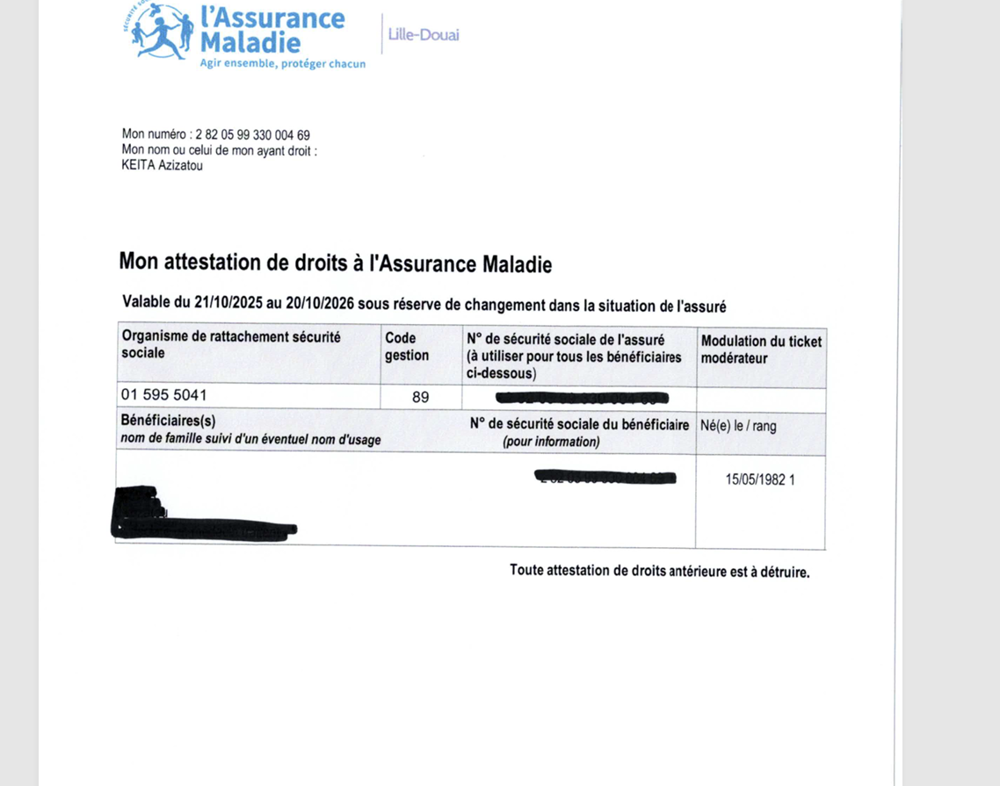
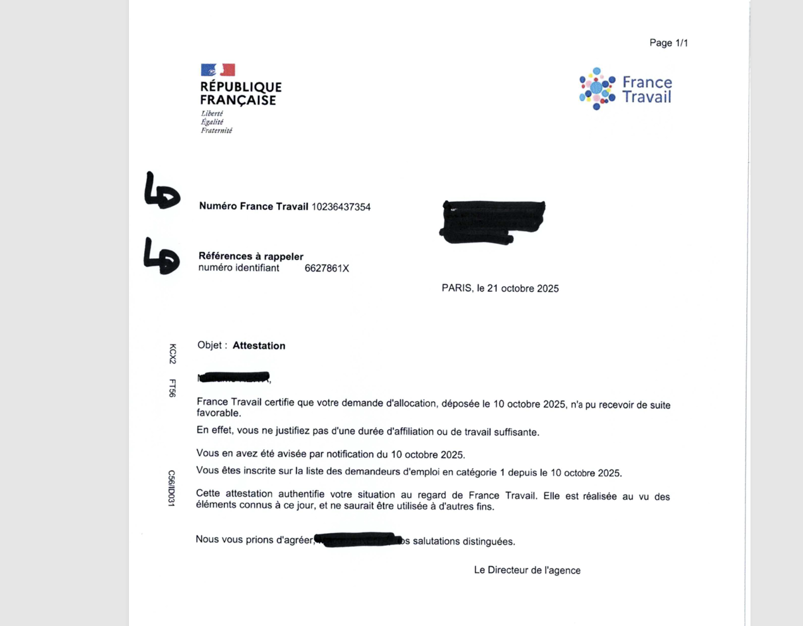

# Inscription administrative

L'inscription administrative est **obligatoire chaque année**. Sans dossier validé, tes accès sont automatiquement coupés (campus, LMS/Intra).

### ⏳ Calendrier & Échéances

---
- **Date limite :** Surveille tes mails et Discord/Slack, les dates y sont annoncées chaque année, mais la date limite est généralement fin octobre ou début novembre.
- **Le cas particulier d'avril :** Si tu t'inscris en **avril**, cela concerne l'année scolaire *en cours*. Tu devras donc **impérativement te réinscrire en octobre/novembre** pour l'année suivante.
- **Délai :** Le traitement prend quelques jours. **N'attends pas le dernier moment** pour éviter le blocage de ton compte !

> 
  ### Checklist avant de soumettre tes documents
  Pour que ton dossier soit validé du premier coup (et nous faire gagner du temps à tous 😉) :
  1. **Validité :** Tes documents doivent dater de **moins de 3 mois**.
  1. **Format :** Vérifie bien le format et la taille des fichiers (voir capture ci-dessous).
  1. **Clarté :** Assure-toi que les scans sont parfaitement lisibles.

### 🛡️ Justificatif de Sécurité Sociale

---

Voici ce qu'il nous faut selon ton profil :
- **Statut Étudiant :** Tu dois fournir une **Attestation de Droits** (à télécharger sur [Ameli.fr](https://www.ameli.fr/)).
- **⚠️ Attention :** Les cartes de mutuelle ou les cartes Vitale scannées **ne sont pas acceptées**. Seule l'attestation officielle de droits est valide.

## 🇪🇺 Étudiants issus de l'Union Européenne

Si tu es ressortissant européen, tu n'as pas besoin de t'affilier au régime français :
- **Document à fournir :** Ta **Carte Européenne d'Assurance Maladie (CEAM)**.
- **Condition :** Elle doit être valide pour toute l'année scolaire en cours.

## 🌍 Étudiants internationaux (Hors UE) ou non rattachés

Pas de panique si tu n'as pas encore de numéro de sécurité sociale français !
- **En attendant ton affiliation :** Tu dois impérativement souscrire à une **assurance privée** (incluant la responsabilité civile et la couverture des frais de santé) pour l'année scolaire.
- **Exemple :** Des offres spécifiques existent comme chez [HEYME](https://heyme.care/fr) ou d'autres assureurs pour étudiants.
  > 
    ***Conseil du staff :**** Ne traîne pas pour lancer tes démarches d'affiliation officielle. C'est gratuit et indispensable. Consulte le guide dédié aux *[*étudiants étrangers sur Ameli.fr*](https://www.ameli.fr/)*.*

### 💼 Attestation France Travail (si tu es demandeur d’emploi)

---

Si tu es inscrit en tant que demandeur d'emploi, prépare ton **avis de situation** de moins de 3 mois.

Une fois ton dossier déposé, tu recevras des instructions complémentaires spécifiques à ton statut par mail. Reste bien attentif à ta boîte de réception.

### Le conseil du staff 😉

---

Vous êtes extrêmement nombreux à vous inscrire en même temps et chaque dossier est vérifié manuellement par nos équipes.
- **Patience & Notifications :** Le traitement peut prendre un peu de temps. Ne t'inquiète pas, tu recevras une notification automatique dès que l'état de ton dossier change (Validé / Refusé / En attente).
- **🤖 Inutile d'envoyer un mail :** Pour nous demander "Où en est mon dossier ?". Cela surcharge inutilement l’équipe et ralentit le traitement pour tout le monde.

**Si ton dossier est complet et lisible, il sera validé dans les meilleurs délais ! 🙏**

---

*
 If your file is not validated, your access will be automatically cut off (campus, LMS/Intra).****
***

### *⏳ Deadlines & Timeline*

---
- ***Deadline:**** Keep an eye on your emails and Discord/Slack; specific dates are announced there every year, usually the deadline is end of October / early November.*
- ***The "April" Case:**** If you register in ****April****, it covers the current academic year. This means you must ****imperatively re-register in November**** for the following academic year.*
- ***Processing Time:**** It takes a few days to review each file. ****Do not wait until the last minute**** to avoid your account being blocked!*

> 
  ***Checklist before submitting your documents****
To get your file validated on the first try (and save everyone some time 😉):*
  - ***Validity:**** Documents must be less than 3 months old.*
  - ***Format:**** Double-check the file format and size (see the screenshot below).*
  - ***Clarity:**** Make sure your scans are perfectly legible.*

### *Social Security Proof*

---

*Here is what we need based on your profile:*

## ***French Student Status***
- *You must provide an ****"Attestation de Droits"**** (downloadable from *[*Ameli.fr*](https://www.ameli.fr/)*).*
- *⚠️ ****Warning:**** Scans of "Mutuelle" cards or "Carte Vitale" are ****not accepted****. Only the official "Attestation de Droits" is valid.*

## ***🇪🇺 EU Citizens***

*If you are an EU national, you don't necessarily need to join the French system:*
- ***Document to provide:**** Your ****European Health Insurance Card (EHIC)****.*
- ***Condition:**** It must be valid for the entire current academic year.*

## ***🌍 International Students (Non-EU) or Unregistered***

*Don't panic if you don't have a French Social Security number yet!*
- ***While waiting for registration:**** You must take out ****private insurance**** (including civil liability and health coverage) for the current academic year.*
- ***Example:**** Specific offers exist, such as *[*HEYME*](https://www.google.com/search?q=https://heyme.care/en)* or other student-focused insurers.*
- *💡 ****Staff Tip:**** Don't delay your official registration process. It’s free and essential. Check the *[*guide for international students on Ameli.fr*](https://www.ameli.fr/)*.*

### ***💼  France Travail Proof (Job Seekers / SFP Status)***

---

*If you are registered as a job seeker:*
- *Prepare your recent ****"Avis de situation"****.*
- *Once your file is submitted, you will receive additional instructions specific to your status via email. ****Stay tuned to your inbox.***

### *Staff tips!*

---

*There are a lot of you registering at the same time, and every single file is manually checked by our team.*
***Patience & Notifications:**** Processing takes time. Don't worry, you will receive an automatic notification as soon as your status changes (Validated / Refused / Pending).*
***🤖 No need to email us:**** To ask "Where is my file?". This unnecessarily overloads the administration and slows down the process for everyone.*
***If your file is complete and clear, it will be validated as soon as possible!**** 🙏*

