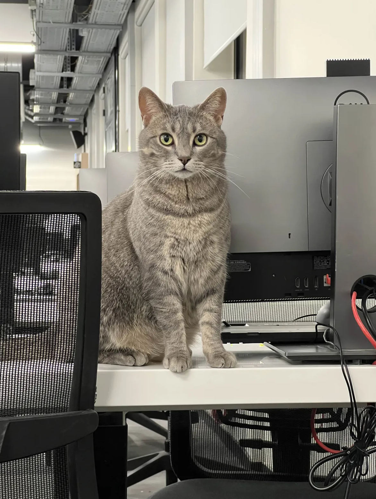

# Le bocal

C’est le bureau du staff, l’endroit où tu peux venir nous trouver en cas de besoin. Quand tu viens au bocal, il faut que tu badges aux endroits indiqués et que tu attendes derrière le bureau d’accueil que quelqu’un vienne s’occuper de toi.

### Nous trouver

---

Le bocal est situé au 1er étage du campus 🗺️ et ouvert aux horaires suivants :

| Jour | Matin | Après-midi |
| --- | --- | --- |
| Lundi | 10h-12h | 14h -18h |
| Mardi | 10h-12h | 14h -18h |
| Mercredi | 10h-12h | 14h -18h |
| Jeudi | 10h-12h | 14h -18h |
| Vendredi | 10h-12h | 14h -18h |
| Samedi | Fermé | Fermé |
| Dimanche | Fermé | Fermé |

### Les différentes équipes

---

Plusieurs équipes travaillent au bocal :
- l’équipe pédagogique qui s’assure notamment du bon déroulé des activités pédagogiques (corrections, exams, rushs…)
- l’équipe SI qui gère toute les infrastructures techniques du campus (serveurs, workstations, Wi-Fi, plateformes dédiées…)
- l’équipe Comm qui organise tous les événements, les animations, coordonne les associations étudiantes et gère la communication externe de 42 Paris
- l’équipe 42i qui gère le programme inclusion, un dispositif de soutien et d’accompagnement destiné aux personnes en situation de vulnérabilité sociale
- l’équipe ADM pour les sujets liés aux démarches administratives 
- l’équipe Relations Entreprises, qui suit l’organisation des stages, gère l’alternance et les relations avec les entreprises qui interviennent sur le campus
- l’équipe Services Généraux qui pilote l’entretien et la maintenance de tout le bâtiment
- l’équipe Cuisine qui s’occupe de Steakoverflow, voir ‣ 
- la direction du campus

### Organigramme

---

### Nous contacter

---

Tu peux également contacter le bocal par :
- Discord & Slack
  - Équipe Pédagogique : staff-pedagogy 
  - Équipe Technique : staff-it
  - Équipe Communication : staff-events
  - Équipe Relations Entreprises : staff-companies
  - Équipe Services Généraux : staff-building
  - Équipe Cuisine : staff-food
- Mail
  - Équipe Pédagogique : [pedago@42paris.fr](mailto:pedago@42paris.fr) 
  - Équipe administrative : [adm@42paris.fr](mailto:adm@42paris.fr)
  - Équipe Inclusion : [inclusion@42paris.fr](mailto:inclusion@42paris.fr)  
  - Équipe Communication : [comm@42paris.fr](mailto:comm@42paris.fr) 
  - Équipe Relations Entreprises : [relations-entreprises@42paris.fr](mailto:relations-entreprises@42paris.fr) 
  - Équipe Cuisine : [cuisine@42paris.fr](mailto:cuisine@42paris.fr) 

> 
  Pense à préciser dans ton mail si tu es sur 42 Next, cela permettra d’obtenir une réponse plus rapide

Pour les besoins spécifiques, tu peux également te rapprocher des référents dédiés :
- referent-handicap@42paris.fr
- referent-mixite@42paris.fr
- referent-harcelement@42paris.fr

### Moulinette

---

Mou Mou pour les intimes - notre star à nous. 

> 
  Oui, c’est le chat !

Comme toute star qui se respecte, Moulinette fait exactement ce qu’elle veut ici. Tu peux la caresser, mais ne la déplace jamais. 
Elle a pris ta chaise ou fait une sieste sur ton clavier ? Change de poste 🙃
Elle miaule devant une porte ? Sois sympa, ouvre-lui !
Ne la nourris pas, il y a déjà suffisamment de croquettes partout sur le campus.

Si jamais, c’est elle 📸

---

*This is the staff office — the place you can come to if you need help. When you come to the Bocal, you must badge in at the indicated access points and wait behind the reception desk until someone comes to assist you.*

### *Finding us*

---

*The Bocal is located on the ****1st floor of the campus**** 🗺️ and is open during the following hours (piscine period):*

| Day | Morning | Afternoon |
| --- | --- | --- |
| Monday | 10:00–12:00 | 2:00–6:00 PM |
| Tuesday | 10:00–12:00 | 2:00–6:00 PM |
| Wednesday | 10:00–12:00 | 2:00–6:00 PM |
| Thursday | 10:00–12:00 | 2:00–6:00 PM |
| Friday | 10:00–12:00 | 2:00–6:00 PM |
| Saturday | Closed | Closed |
| Sunday | Closed | Closed |

### *The teams*

---

*Several teams work at the Bocal:*
- *the Pedago Team, which ensures the smooth running of educational activities (projects, exams, rushes, etc.)*
- *the IT Team, which manages all the campus’s technical infrastructure (servers, workstations, Wi-Fi, dedicated platforms, etc.)*
- *the Communications Team, which organizes all events and activities, coordinates student associations, and manages the external communication of 42 Paris*
- *the 42i Team, which runs the inclusion program, a support and guidance initiative for people in situations of social vulnerability*
- *the ADM Team, responsible for matters related to administrative procedures*
- *the Corporate Relations Team, which oversees internships, manages work-study programs, and handles relationships with companies involved on campus*
- *the Workplace Services Team, which is in charge of the maintenance and upkeep of the entire building*
- *the Steakoverflow Team, which manages Steakoverflow - see **‣** *
- *the campus management team*

### ***Organizational chart***

---

### *Contacting us*

---

*You can also contact the Bocal through:*
- ***Discord & Slack***
  - Pedago Team: staff-pedagogy
  - IT Team: staff-it
  - Communications Team: staff-events
  - Corporate Relations Team: staff-companies
  - Workplace Services Team: staff-building
  - Kitchen Team: staff-food
- ***Email***
  - Pedago Team: [pedago@42paris.fr](mailto:pedago@42paris.fr)
  - ADM Team: [adm@42paris.fr](mailto:adm@42paris.fr)
  - Inclusion Team: [inclusion@42paris.fr](mailto:inclusion@42paris.fr)
  - Communications Team: [comm@42paris.fr](mailto:comm@42paris.fr)
  - Corporate Relations Team: relations-entreprises@42paris.fr
  - Steakoverflow Team: cuisine@42paris.fr

> 
  *Make sure to mention if you’re using 42 Next in your email request, it will help us to reply faster.*

*For specific needs, you can also reach out to dedicated contacts:*
- *referent-handicap@42paris.fr*
- *referent-mixite@42paris.fr*
- *referent-harcelement@42paris.fr*

### *Moulinette*

---

***Mou Mou to her close friends**** — our very own star.*

> 
  *Yes, it’s the cat!*

*Like any true star, ****Moulinette does exactly whatever she wants here****. You can pet her, but ****never move her****.*
*Did she take your chair or fall asleep on your keyboard? Change workstations *🙃
*Is she meowing in front of a door? Be nice — open it for her!*
*Do not feed her; there are already plenty of food bowls all around the campus.*
*In case you were wondering… ****this is her**** *📸

