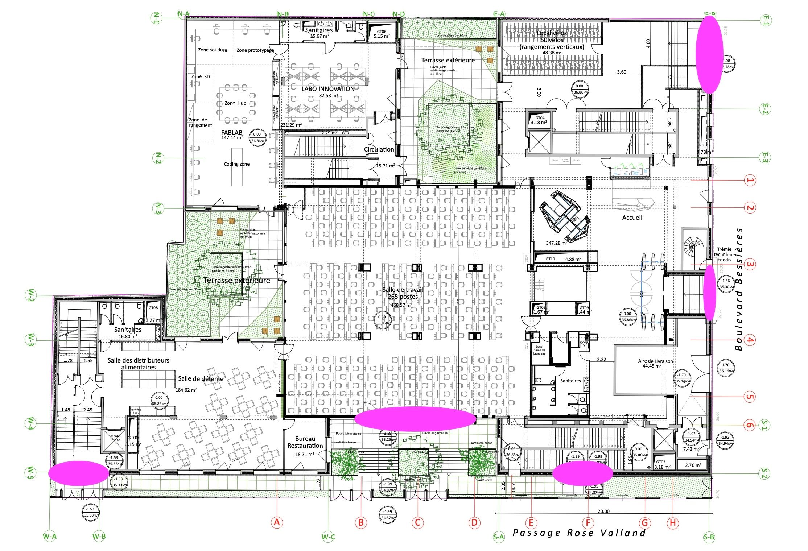

# Le campus

Le campus de 42 Paris se compose du bâtiment principal (l’école, située au 96 boulevard Bessières) et de ‣. L’école est constituée de 7 étages et 1 sous-sol. L’ensemble du campus est ouvert 24h/24 et 7j/7.

### Les règles en cluster

---

42 Paris t’accueille dans 6 clusters : F0 au RDC, F1 au 1er étage, F1b également au 1er étage dont l’accès se fait via le cluster F1, F2 au 2ème étage, F4 au 4ème étage, F6 au 6ème étage.
Les règles s’appliquant aux clusters sont les suivantes :
- Pas de consommation ni de boissons sucrées ni de nourriture (bonbon, sandwich, barre chocolatée, etc.)
- La seule chose que tu peux consommer est de l'eau plate ou gazeuse (non aromatisée)
- Le récipient de cette dernière doit se trouver à tes pieds et NON SUR LE BUREAU
- Tu ne peux pas brancher d'appareil sur la prise jack des iMac (car elle s'abîme et se casse très vite)
- Sans la permission du staff, il est interdit de brancher / débrancher / bouger / éteindre ou rallumer le matériel mis à disposition (le clavier, souris, câble d’alimentation, ethernet...)
- Il est interdit de jouer à des jeux sur les ordinateurs
- Vous n'avez pas le droit de dormir ou de faire de sieste
- Tout papier / lingette inutilisé doit être jeté à la poubelle
- Les sièges sont uniquement faits pour s'assoir et non pour poser ses pieds
- Durant l’année (hors période piscine), le cluster f4 est silencieux, vous ne devez donc pas faire de bruit et chuchotez si vous souhaitez communiquer. Pour ce qui est des autres clusters, vous pouvez parler normalement, mais respectez vos voisins et évitez de crier.
- Si des espaces de travail One2One se trouvent dans un cluster silencieux veillez à chuchoter et à ne pas perturber le cluster
- Il est interdit de travailler en cluster avec son ordi personnel si ce n’est pas sur les postes Flex. Les postes Flex sont présents en clusters f2, f4 et en f6. Des espaces de travail vous sont aussi réservés hors des clusters.

Une liste plus complète des règles de conduite de l'école en général se trouve dans le Règlement Intérieur.

### Cluster silencieux

---

En règle général, nous gardons toujours un cluster dit silencieux. Ce cluster est habituellement le f4. Des règles spécifiques s’appliquent :
- les évaluations sont interdites, il est interdit de discuter
- les claviers mécaniques ne sont pas autorisées
- Moulinette n’y est pas invitée

> 
  Pour le bien-être de tous, merci de veiller à respecter ces règles en toute circonstance.

### En cas d’incendie

---

Il nous semble important de rappeler certaines règles essentielles à la sécurité de tous car un exercice incendie peut vite arriver :
- l’évacuation doit se faire au plus vite ⏱️ dès que le signal d’alarme retentit, merci de laisser tes affaires sur place et de prendre uniquement ton badge 🪪
- l’évacuation doit se faire par l’issue de secours la plus proche (et non pas systématiquement par l’accueil ❌)

Tu trouveras ci-dessous le plan des issues de secours repérées en rose. Comme tu peux le voir, de nombreuses sorties existent :
- sur le passage Rose Valland pour les cafétérias, le sous-sol et l’amphi
- sur le haut du Boulevard Bessières pour les escaliers

❓ En cas de doute sur l’issue de secours la plus proche, suis les éclairages directionnels verts installés au-dessus des portes, dans les escaliers ou sur les murs du bâtiment, ils te guideront vers la sortie la plus proche (qui est rarement l’accueil). Lève la tête et regarde autour de toi, tu devrais les voir.
Une fois sorti du bâtiment merci de ne pas rester devant 42 Paris et de te rendre au deux points de rassemblements situés :
- devant l’école maternelle
- à l’angle du Passage Rose Valland, devant le lycée

> 
  Nous comptons sur toi pour respecter ces consignes et éviter de générer des bouchons dans les escaliers au rez-de-chaussée et à l’accueil.

### **Zones fumeurs et non fumeur**

---

Il est interdit de fumer ou de vapoter à l’intérieur du campus. Tu peux cependant fumer ou vapoter dans les zones prévues à cet effet, en respectant la propreté des lieux, à savoir :
- la terrasse située entre le le Local Vélo et Lab Inno
- la terrasse du 2ème étage, à proximité du Bloc
- la terrasse du Café avant la fin du monde (f2)
- la petite zone de la terrasse Douglas Adams (f3)

### **Règles des sanitaires**

---

42 Paris possède des sanitaires mixtes à tous les étages.
Une équipe ménage travaille 7j/7 afin de vous offrir un environnement propre et sain. Nous te remercions de respecter leur travail, n'oublie pas qu'un sourire, un bonjour c'est sympa aussi !
Voici les règles à suivre concernant les sanitaires :
- Si tu as un problème lié au ménage / bâtiment, merci de poster un message sur le channel #staff-building sur Discord/Slack
- Des sanitaires genrés se trouvent aux 2ème étage
- Si tu vois la pancarte "ménage en cours" devant la porte des sanitaires, il est interdit d'y entrer
- Les serviettes doivent être mises le long des rambardes des escaliers (ou en extérieur les jours de beau temps)
- Des brosses (pour toilettes) et raclettes (pour les douches) sont à disposition, merci de les utiliser pour laisser des sanitaires propres derrière vous

---

*42 Paris welcomes you across 6 clusters: f0 on the ground floor, f1 on the 1st floor, f1b also on the 1st floor (accessible via the f1 cluster), f2 on the 2nd floor, f4 on the 4th floor, and f6 on the 6th floor.*

### *Cluster rules*

---

*42 Paris welcomes you in 3 clusters: Totoro / f0 on the ground floor, Simpson / f1 on the 1st floor, and Son Goku / f2 on the 2nd floor.*
*The following rules apply in the clusters:*
- *No consumption of sugary drinks or food (candy, sandwiches, chocolate bars, etc.)*
- *The only thing you are allowed to consume is still or sparkling water (unflavored)*
- *Your water container must be placed at your feet and ****NOT ON THE DESK***
- *You may not plug devices into the iMac jack port (it gets damaged and breaks very quickly)*
- *Without staff permission, it is forbidden to plug/unplug/move/turn off or restart any provided equipment (keyboard, mouse, power cable, ethernet, etc.)*
- *Playing games on the computers is prohibited*
- *Sleeping or taking naps is not allowed*
- *Any unused paper/wipes must be thrown in the trash*
- *Chairs are only meant for sitting, not for putting your feet on*
- *During the year (outside of the “pool period”), f4 is a silent area. You must not make noise there, and you should whisper if you need to communicate. In the other clusters, you may speak normally, but please respect those around you and avoid shouting.*
- *If One2One workspaces are located within a silent cluster, make sure to whisper and avoid disturbing the area.*
- *It is not allowed to work in a cluster using your personal laptop unless you are at Flex stations. Flex stations are available in f2, f4, and f6. Workspaces are also available for you outside of the clusters.*

*A more complete list of the school’s general code of conduct can be found in the Internal Regulations.*

### *Silent cluster*

---

*As a general rule, we always keep one cluster designated as a “quiet cluster.” This is usually cluster F4. Specific rules apply:*
- *evaluations are not allowed, and talking is prohibited*
- *mechanical keyboards are not allowed*
- *Moulinette is not welcome there*

> 
  *For everyone’s well-being, please make sure to respect these rules at all times.*

### *In case of fire*

---

*We believe it is important to remind everyone of a few essential safety rules — fire drills can happen at any time:*
- *Evacuation must take place as quickly as possible ⏱️ as soon as the alarm sounds. Please leave your belongings behind and take only your badge 🪪*
- *Evacuation must be done via the nearest emergency exit (and not systematically through reception ❌)*

*Below is a map of the emergency exits marked in pink. As you can see, there are many exits:*
- *onto Passage Rose Valland for the cafeterias, basement, and amphitheater*
- *onto the upper part of Boulevard Bessières for the staircases*

*❓ If you are unsure about the nearest emergency exit, follow the green directional lights installed above doors, in staircases, or on the building’s walls — they will guide you to the nearest exit (which is rarely the reception area). Look up and around you; you should be able to spot them.*
*Once outside the building, please do not remain in front of 42 Paris and proceed to one of the two assembly points located:*
- *in front of the kindergarten*
- *at the corner of Passage Rose Valland, in front of the high school*

> 
  *We rely on you to respect these instructions and avoid creating congestion in the staircases on the ground floor and at reception.*

### *Smoking and non-smoking areas*

---

*Smoking or vaping inside the campus is strictly forbidden. However, you may smoke or vape in the designated areas, while respecting cleanliness:*
- *the terrace located between the Bike Room and Lab Inno*
- *the 2nd-floor terrace, near the Bloc*
- *the terrace of Café “Avant la fin du monde” (f2)*
- *the small area on the Douglas Adams terrace (f3)*

### *Restroom rules*

---

*42 Paris has mixed-gender restrooms on every floor.*
*A cleaning team works 7 days a week to provide you with a clean and healthy environment. Please respect their work — don’t forget that a smile and a friendly hello go a long way!*
*Here are the rules to follow regarding restrooms:*
- *If you encounter an issue related to cleaning or the building, please post a message on the #bocal channel on Discord*
- *Gendered restrooms are located on the 2nd floor*
- *If you see a “cleaning in progress” sign in front of the restrooms, entry is forbidden*
- *Towels must be placed along the stair railings (or outside on nice weather days)*
- *Brushes (for toilets) and squeegees (for showers) are available — please use them to leave the restrooms clean after use*

