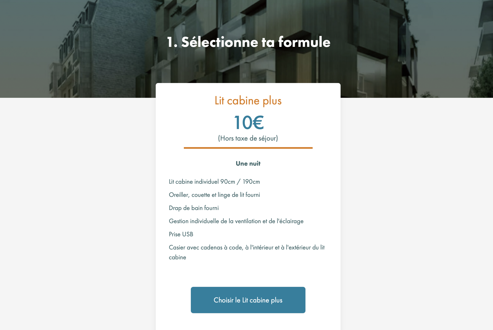

# NOC42

NOC42 est le nom donné aux dortoirs de 42 Paris situés juste en face de l’école, au 89 boulevard Bessières (bâtiment Bess).

### Comment réserver ?

---

Les réservations se font à la nuit, directement sur [book.noc42.fr](http://book.noc42.fr). Le tarif est de 10€/nuit, hors taxe de séjour. Pour information, les dortoirs sont non mixtes. Tu pourras arriver sur place à partir de 14h, et ton badge d’accès sera activé automatiquement le jour de ta réservation.

> 
  Les réservations ferment à 17h pour la soirée. Pense à anticiper un peu.

NOC42 ayant été pensé comme une solution d’hébergement temporaire, chaque étudiant peut y séjourner jusqu’à 120 nuits au cours de son cursus. En cas de doute sur le nombre de nuits disponibles, un compteur est accessible sur la page d’accueil et le profil via la plateforme. 

### Sur place

---

Sur place, tu trouveras un espace commun au rez-de-chaussée, le “Café Associatif”, pour manger, échanger avec les autres résidents ect. Cet espace propose :
- des micro-ondes
- un frigo
- une machine à café et boissons chaudes
- une fontaine à eau

> 
  Pour des questions réglementaires, il n’est malheureusement pas possible de cuisiner à NOC42.

Si tu souhaites déposer des affaires dans le frigo, merci de bien veiller à les étiqueter avec les étiquettes disponibles à l’accueil en indiquant ton login et la date à laquelle tu les déposes. Pour information, le frigo est vidé tous les vendredis.

### Dans ton lit

---

Chaque lit est équipé d’un détecteur de fumée individuel (situé sur le plafond du lit, au centre). Ce détecteur permet d’assurer la sécurité de tous et le déclenchement rapide de l’alarme incendie en cas de danger.
Il est strictement interdit de toucher, démonter ou obstruer ce détecteur de fumée. Conformément au Règlement intérieur, toute violation de ces règles peut entrainer l’exclusion de NOC42.

### En partant

---

En quittant NOC42 le dernier jour de ta réservation, merci de bien retirer tes draps et de les placer dans les chariots prévus à cet effet situés dans chaque dortoir.

### Des questions ?

---

Contacte l’équipe par email à [hello@noc42.fr](mailto:hello@noc42.fr).

---

*NOC42 is the name given to the dormitories of 42 Paris, located just across from the school at 89 boulevard Bessières (Bess building).*

### *How to book?*

---

*Bookings are made per night, directly on *[*book.noc42.fr*](http://book.noc42.fr/)*. The rate is €10 per night, excluding tourist tax. Please note that the dormitories are single-sex. You can arrive on-site from 2:00 PM, and your access badge will be automatically activated on the day of your booking.*

> 
  *Bookings close at 5:00 PM for the same evening, so make sure to plan ahead.*

*Since NOC42 is designed as a temporary accommodation solution, each student can stay up to 120 nights during their studies. If you’re unsure how many nights you have left, a counter is available on the homepage and in your profile on the platform.*

### *On-site*

---

*On-site, you’ll find a shared space on the ground floor called the “Café Associatif,” where you can eat and interact with other residents. This space offers:*
- *microwaves*
- *a fridge*
- *a coffee machine and hot drinks*
- *a water fountain*

> 
  *Due to regulations, cooking is unfortunately not allowed at NOC42.*

*If you wish to store items in the fridge, please make sure to label them using the tags available at reception, indicating your login and the date you stored them. For your information, the fridge is emptied every Friday.*

### *In your bed*

---

*Each bed is equipped with an individual smoke detector (located on the ceiling of the bed, in the center). This detector ensures everyone’s safety and enables the fire alarm to be triggered quickly in case of danger.*
*It is strictly forbidden to touch, dismantle, or obstruct this smoke detector. In accordance with the internal regulations, any violation of these rules may result in exclusion from NOC42.*

### *When leaving*

---

*When leaving NOC42 on the last day of your booking, please remove your bedsheets and place them in the carts provided in each dormitory.*

### *Questions?*

---

*Contact the team by email at *[*hello@noc42.fr*](mailto:hello@noc42.fr)*.*

