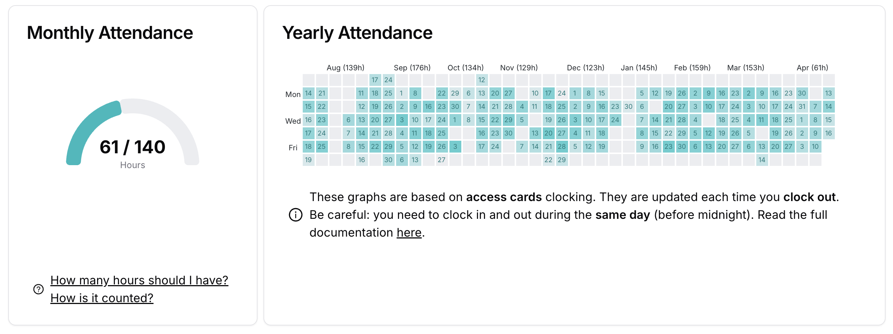

# Statut SFP : Guide de l'assiduité

En tant que demandeur d'emploi, tu as la possibilité d'être en formation à 42 Paris. Ce statut de **Stagiaire de la Formation Professionnelle (SFP)** t'ouvre des droits, mais impose aussi des règles strictes de suivi de la part de France Travail.

## 💡 L'essentiel à savoir

---

En tant que SFP, tu es soumis à des conditions strictes pour maintenir ton statut et ta rémunération :
- **Actualisation mensuelle :** Tu dois déclarer que tu es en formation lors de chaque actualisation, **y compris pendant ton stage**.
- **ARE → AREF :** Si tu as des droits ouverts, ton Allocation Retour à l'Emploi (ARE) devient une Allocation Retour à l'Emploi Formation (AREF).
- **L’assiduité :** Tu dois réaliser **140 heures de formation par mois** sur le campus.
  - **Présentiel uniquement :** Seul le travail effectué sur le campus est comptabilisé. Le travail à distance n'est pas pris en compte.
  - **Volume horaire :** Tu peux répartir tes **140h de présentiel **librement sur le mois. Le campus t’es accessible 7 jours sur 7, 24 heures sur 24.

> 
  * 42 Paris a l’obligation de déclarer à France Travail toute absence, ce qui entraînera une baisse de tes allocations (génération de trop-perçus).*

### Prise en compte des heures par le badge

---

Tes heures sont comptabilisées uniquement via ton badge nominatif d’accè au campus. **Pas de badge, pas d'heures comptabilisées.**
1. Badge à chaque entrée ET chaque sortie du bâtiment, même si la porte est déjà ouverte
1. **La règle de minuit :** Pour qu'un intervalle soit valide, l'entrée et la sortie doivent être enregistrées **le même jour civil**.
  - Si tu restes bosser la nuit : tu dois sortir et re-badger entre **23h59 et 00h01**.
  - Si tu ne badges pas en sortie avant minuit, cet intervalle sera **définitivement perdu**. Pour t’aider, tu trouveras quelques exemples plus bas.

> 
  **Fraude :** Toute fraude ou tentative de fraude entraînera une convocation en conseil de discipline, l’annulation des heures fraudées et une sanction pouvant aller jusqu'à l'exclusion définitive de 42 Paris.

### 📉 Comprendre le calcul de tes heures (exemples)

---

Pour que tes heures soient validées, l’entrée et la sortie doivent impérativement être enregistrées **le même jour civil (entre 00h00 et 23h59)**.
**1. L'exemple classique (Parfait)**
- **10h00** : Entrée | **12h00** : Sortie (2h)
- **13h00** : Entrée | **18h00** : Sortie (5h)
- **Total validé : 7h de présence.**

**2. L'exemple de l'oubli de minuit (Intervalle perdu)**
- **Jour 1 : 16h00** : Entrée | **20h00** : Sortie (4h)
- **Jour 2-3 : 12h00** : Entrée | **03h00** (le lendemain) : Sortie (⚠️)
- **Total validé : 4h de présence sur le jour 1, 0h de présence sur le jour 2-3.** Pourquoi ? L'intervalle 12h00 → 03h00 est **définitivement perdu** car tu es sorti(e) un jour différent de celui de ton entrée.

**3. L'exemple "Nuit Blanche" (La bonne méthode)**
Si tu restes sur le campus après minuit, **tu dois sortir et re-rentrer physiquement** pour valider tes heures :
- **JOUR 1 :** 12h00 (Entrée) → **23h55 (Tu badges en sortie)** = 11h55 validées.
- **JOUR 2 :** **00h05 (Tu badges en entrée)** → 04h15 (Sortie) = 4h10 validées.
- **Total : 16h05 validées.**

> ***⚠️ À retenir :**** Si tu ne badges pas en sortie (****Out****) avant ****23h59****, tout ton bloc de travail depuis ta dernière entrée est annulé par le système. Pour éviter que ta journée de travail ne passe à la trappe, ****pense à sortir et re-rentrer physiquement à minuit !
> ****💡 ****Conseil du Staff :**** Règle une alarme sur ton téléphone à ****23h50**** pour ne jamais louper le coche.*

### **🛠 Outils de suivi des heures**

---

Pour t’aider dans le suivi de ton assiduité, l’équipe 42 Paris a développé un outil permettant de consulter le nombre d’heures déjà réalisées. Cet outil est accessible sur [dashboard.42paris.fr](http://dashboard.42paris.fr). 

> 
  **Une question ?** N'attends pas la fin du mois, passe voir le staff au Bocal !

### *🎓 Job Seeker Status (SFP)*

---

*As a job seeker, you have the opportunity to follow your training at 42 Paris. This status of ****Vocational Training Trainee / Stagiaire de la Formation Professionnelle (SFP)**** grants you specific rights but also imposes strict monitoring rules.*

### *💡 The Essentials*

---
- ***Monthly Update:**** You must declare that you are "in training" (en formation) during every monthly update, including during your internship.*
- ***ARE → AREF:**** If you have active benefits, your Job Seeker's Allowance (ARE) becomes a Vocational Training Allowance (AREF).*
- ***Attendance requirement:**** You must complete ****140 hours**** of training per month ****on campus****.*

> 
  ***Warning:**** 42 Paris have (it’s mandatory for us) to declare all failure in meeting this attendance quota to France Travail. It will lead to a reduction in your allowances (generation of overpayments).*

### *🕒 Tracking Hours via Badge*

---

*Your hours are tracked exclusively via your personal badge at the Campus. ****No badge, no hours recorded.***
- ***Badge for every entry AND exit****, even if the door is already open.*
- ***The Midnight Rule:**** For a time interval to be valid, the entry and exit must be recorded on the ****same calendar day****.*
- ***If you work through the night:**** You must go out and badge again between 11:59 PM and 12:01 AM.*
- ***If you do not badge out before midnight****, that specific interval will be ****permanently lost****. Check the examples below for help.*

> 
  ***Fraud:**** Any fraud or attempt at fraud will result in a summons to a disciplinary council, the cancellation of the fraudulent hours, and a sanction that can go as far as permanent exclusion from 42 Paris.*

### *📉 Understanding the Calculation (Examples)*

---

*For your hours to be validated, the entry and exit must be recorded within the same calendar day (between 00:00 and 23:59).*
***1. The Classic Example (Perfect)***
- *10:00 AM: Entry | 12:00 PM: Exit (2h)*
- *1:00 PM: Entry | 6:00 PM: Exit (5h)*
- ***Total validated: 7 hours of presence.***

***2. The "Forgot Midnight" Example (Lost Interval)***
- *Day 1: 4:00 PM: Entry | 8:00 PM: Exit (4h)*
- *Day 2: 12:00 PM: Entry | 3:00 AM (Next Day): Exit (⚠️)*
- ***Total validated: 4h on Day 1, 0h on Day 2.**** Why? The 12:00 PM → 03:00 AM interval is permanently lost because you exited on a different day than your entry.*

***3. The "All-Nighter" Example (The Correct Way)****
If you stay on campus after midnight, you must physically exit and re-enter to validate your hours:*
- ***DAY 1:**** 12:00 PM (Entry) → 11:55 PM (Badge Out) = ****11h55 validated.***
- ***DAY 2:**** 12:05 AM (Badge In) → 4:15 AM (Exit) = ****4h10 validated.***
- ***Total: 16h05 validated.***

> *⚠️ ****Remember:**** If you do not badge out before 11:59 PM, your entire work block since your last entry is canceled by the system. To avoid losing your workday, remember to physically badge out and back in at midnight!*
  *💡 ****Staff Tip:**** Set an alarm on your phone for 11:50 PM so you never miss it.*

### *🛠 Hour Tracking Tools*

---

*To help you track your attendance, the 42 Paris team has developed a tool to consult the number of hours you have already completed. This tool is accessible at *[***dashboard.42paris.fr***](https://www.google.com/search?q=https://dashboard.42paris.fr)*.*

> 
   Any questions? Don't wait until the end of the month - come and see the staff at the **Bocal**!
