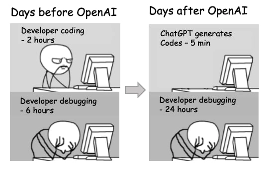

# Triche & IA

## **La frontière entre peer-learning et triche**

---

L'ADN de 42, c'est l'apprentissage par les pairs : tu apprends avec les autres, grâce aux autres. Mais cette proximité crée une zone grise qu'il est important de comprendre, parce que la frontière entre s'entraider et tricher peut être très mince.

## 1. Avoir le même code qu'un camarade

---

Rendre un code identique à celui d'un autre étudiant est de la triche, même si vous avez travaillé "ensemble".
- **Peer-learning :** Discuter d'une approche, expliquer un concept, se débloquer sur une logique.
- **Triche :** Recopier les mêmes lignes ou partager son fichier source.
- **La règle d'or :** La discussion est encouragée, le code reste individuel. Tu dois être capable d'expliquer chaque ligne que tu as écrite.

## **2. S'inspirer de code trouvé sur internet**

---

Chercher de la documentation, lire un article sur un algorithme, comprendre un concept grâce à un exemple : c'est normal et sain. 
- **Le piège :** trouver une solution toute faite sur Stack Overflow ou GitHub et la recopier sans avoir d'abord cherché par toi-même, c'est te priver de l'essentiel : le cheminement intellectuel qui mène à la solution.
- **L’enjeu : **ce n'est pas seulement une question de règles, c'est une question d'efficacité. Le code que tu as trouvé toi-même, tu t'en souviens. Celui que tu as copié, tu l'oublies dès que tu fermes l'onglet.

## **3. Aider trop activement un camarade**

---

La triche n'est pas toujours du côté de celui qui reçoit. Écrire du code à la place d'un camarade, lui dicter la solution ou lui envoyer ton code source "pour qu'il s'inspire" : c'est aussi de la triche. Tu lui rends service à court terme, tu lui nuis à long terme, et tu t'exposes toi aussi à des sanctions.

## **Et l'IA ?**

---

**Durant la Piscine, l’utilisation de l’IA est interdite. **Dans le Common Core, on ne va pas pas te l'interdire, mais on pense important que tu comprennes pourquoi t'en passer, au moins au début, est dans ton intérêt.
Utiliser l'IA trop tôt dans ton parcours peut te nuire pour plusieurs raisons concrètes :
- **Préserver ta capacité à résoudre des problèmes** : penser de manière critique, décomposer un problème complexe, persévérer face à un bug, ce sont des muscles qui ne se développent qu'à l'effort.
- **Éviter l'illusion de savoir** : ChatGPT peut te donner une réponse qui semble juste et convaincante, et qui est pourtant fausse ou inadaptée à ton contexte. Si tu ne comprends pas ce que tu lis, tu ne pourras pas le détecter.
- **Éviter la fixation cognitive** : quand tu vois une solution toute faite, ton cerveau a tendance à s'y accrocher. Tu perds alors la capacité d'explorer d'autres pistes, parfois bien meilleures. C'est ce qu'on appelle l'effet tunnel.
- **Apprendre à déboguer** : c’est une compétence clef du métier ; quand quelque chose ne fonctionne pas (et cela arrivera forcément), il faut savoir déconstruire son raisonnement pour identifier l’erreur. Et ça, ça s’apprend uniquement par la pratique.

En t'attaquant aux problèmes par toi-même en premier, tu construis des bases solides en pensée computationnelle, en résilience et en autonomie. Ce sont ces qualités qui feront de toi un bon développeur.

## **L'IA en Advanced Core : un outil à part entière**

---

Tu as maintenant les bases qui te permettent d'aborder l'IA avec le bon regard, celui d'un développeur qui comprend ce qu'il utilise.
Le marché du travail attend de toi que tu saches travailler avec l'IA. Savoir formuler un prompt précis, évaluer la pertinence d'une réponse générée, adapter et intégrer du code produit par un modèle : ce sont des compétences techniques réelles, qui font désormais partie du quotidien d'un développeur.
C'est justement parce que tu maîtrises les fondamentaux que tu peux en tirer quelque chose d'utile. Un développeur qui ne comprend pas ce que l'IA génère ne peut ni le corriger, ni le fiabiliser, ni l'intégrer correctement. Au-delà du code, tu peux aussi t'appuyer sur des outils de productivité IA pour organiser ta veille, structurer tes projets ou documenter ton travail. L'objectif n'est pas de tout automatiser, mais de te concentrer sur ce qui a de la valeur : la conception, l'architecture, la résolution de problèmes complexes. L'IA devient alors un accélérateur pour ceux qui savent déjà où ils vont.

## **Ce que la triche révèle vraiment**

---

Dans tous ces cas, le problème n'est pas moral, il est pédagogique. Tricher à 42, c'est avant tout se mentir à soi-même sur son propre niveau. Les examens, les projets avancés et le monde professionnel ne laissent aucune place à ce genre de dette.
Pour une définition précise de ce qui constitue un cas de triche à 42 Paris et les sanctions encourues, tu peux te référer au Règlement Intérieur. Encore et toujours, lui. Le lire, tu devras.

---

## ***The Line Between Peer-Learning and Cheating***

*The DNA of 42 is peer-based learning: you learn with others, through others. But this proximity creates a gray area that is important to understand, because the line between helping each other and cheating can be very thin.*

## *1. Having the same code as a peer*

*Submitting code that is identical to another student's is cheating, even if you worked "together."*
- ***Peer-learning:**** Discussing an approach, explaining a concept, unblocking each other on logic.*
- ***Cheating:**** Copying the same lines or sharing your source file.*
- ***The golden rule:**** Discussion is encouraged, but the code remains individual. You must be able to explain every line you have written.*

## *2. Getting inspired by code found on the internet*

*Searching for documentation, reading an article about an algorithm, understanding a concept through an example: this is normal and healthy.*
- ***The trap:**** Finding a ready-made solution on Stack Overflow or GitHub and copying it without having searched for it yourself first is depriving yourself of the essential: the intellectual process that leads to the solution.*
- ***What's at stake:**** It is not just a question of rules; it is a question of efficiency. You remember the code you found yourself. You forget the code you copied as soon as you close the tab.*

## *3. Helping a peer too actively*

*Cheating is not always on the side of the receiver. Writing code in place of a peer, dictating the solution to them, or sending them your source code "for inspiration" is also cheating. You are doing them a favor in the short term, but you are harming them in the long term, and you are also exposing yourself to sanctions.*

## ***What About AI?***

*During the Piscine, using AI tools is not permitted. In the Common Core, we aren't going to forbid it, but we believe it's important for you to understand why going without it is in your own best interest.*
*Using AI too early in your journey can genuinely hold you back, for several concrete reasons:*
- ***Preserving your problem-solving ability****: thinking critically, breaking down a complex problem, pushing through a bug, these are muscles that only develop through effort.*
- ***Avoiding the illusion of understanding****: ChatGPT can give you an answer that sounds right and convincing, yet is wrong or completely unsuited to your context. If you do not understand what you are reading, you will not be able to spot it.*
- ***Avoiding cognitive fixation****: when you see a ready-made solution, your brain tends to latch onto it. You lose the ability to explore other paths, sometimes far better ones. This is what is called the tunnel effect.*
- ***Learning to debug****: this is a key professional skill; when something doesn't work (and it inevitably will), you must know how to deconstruct your reasoning to identify the error. And that is something that can only be learned through practice.*

*By tackling problems yourself first, you build solid foundations in computational thinking, resilience and autonomy. Those are the qualities that will make you a good developer.*

## *AI in the Advanced Core: a tool in its own right*

*You now have the foundations that allow you to approach AI with the right perspective, that of a developer who understands what they are using.*
*
The job market expects you to know how to work with AI. Knowing how to formulate a precise prompt, evaluate the relevance of a generated response, and adapt and integrate code produced by a model: these are real technical skills that are now part of a developer's daily life.*
*It is precisely because you master the fundamentals that you can get something useful out of it. A developer who does not understand what the AI generates can neither correct it, nor make it reliable, nor integrate it correctly. Beyond code, you can also rely on AI productivity tools to organize your monitoring, structure your projects, or document your work. The goal is not to automate everything, but to focus on what has value: design, architecture, and complex problem-solving. AI then becomes an accelerator for those who already know where they are going.*

## ***What Cheating Really Reveals***

*In all these cases, the problem is not moral, it is pedagogical. Cheating at 42 is above all lying to yourself about your own level. Exams, advanced projects and the professional world leave no room for that kind of debt.*
*For a precise definition of what constitutes cheating at 42 Paris and the applicable sanctions, you can refer to the Internal Rules. Once again. Read it.*
